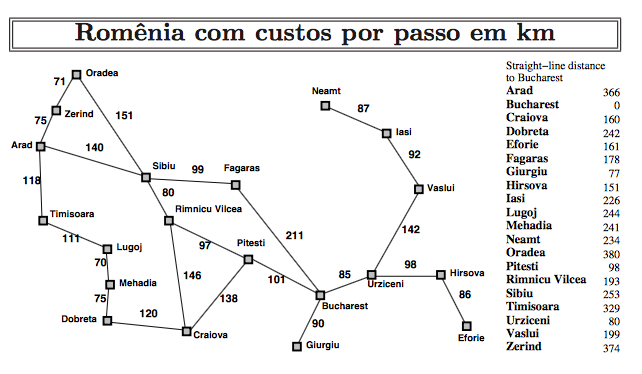

# IA Utilizando Buscas
> Projeto feito em parceria com <a href="https://github.com/tiagors09" target="_blank">Tiago Rodrigues</a>

Nesse projeto utilizamos vários tipos de busca para encontrar caminhos entre cidades, utilizando o mapa da Romênia como exemplo.

<div align="center">



</div>

## Como Executar

Para executar o projeto, basta executar o arquivo App.java, que está na pasta src passando a busca a ser usada, cidade de origem e cidade de destino como argumentos.

```bash
java -cp ./bin App [busca] [origem] [destino]
```

### Exemplo

```bash
java -cp ./bin App bae Arad Bucharest
```

### Argumentos

- busca
  - bsl = busca em largura,
  - bcu = busca de custo uniforme,
  - bcp = busca em profundidade,
  - bgl = busca gulosa,
  - bae = busca a estrela
- origem
  - Nome da cidade de origem (ex: Arad) sempre com a primeira letra maiúscula
  - O nome da cidade deve ser igual ao nome da cidade no mapa
- destino
  - Nome da cidade de destino (ex: Bucharest) sempre com a primeira letra maiúscula
  - ⚠️: para as buscas heurísticas, o destino deve ser sempre Bucharest já que só temos a heurística para essa cidade
  - ⚠️: Para a cidade Rimnicu Vilcea passe o nome unido por um "-" (ex: Rimnicu-Vilcea)

## Buscas Implementadas

- [Busca em Largura](#busca-em-largura)
- [Busca em Profundidade](#busca-em-profundidade)
- [Busca de Custo Uniforme](#busca-de-custo-uniforme)
- [Busca Heurística](#busca-heurística)
  - [Busca Gulosa](#busca-gulosa)
  - [Busca A\*](#busca-a)

## Busca em Largura

A busca em largura é uma busca cega, ou seja, não utiliza heurísticas para encontrar o caminho. Ela expande todos os nós vizinhos do nó atual, e depois expande os vizinhos dos vizinhos, e assim por diante, até encontrar o nó objetivo.

<div align="center">


</div>

Com ela encontramos o caminho mais curto, em número de nós, mas não necessariamente o mais curto em distância percorrida. Ela não é muito eficiente, pois expande todos os nós vizinhos do nó atual, mesmo que eles não sejam promissores.

## Busca em Profundidade

A busca em profundidade também é uma busca cega. Ela expande o primeiro nó vizinho do nó atual, e depois expande o primeiro nó vizinho do nó vizinho, e assim por diante, até encontrar o nó objetivo.

<div align="center">


</div>

Com ela não necessariamente encontramos o caminho mais curto, porém garantimos que algum caminho será encontrado, pois ela explora todos os caminhos possíveis.

## Busca de Custo Uniforme

A busca de custo uniforme é uma busca onde o custo de cada nó é levado em consideração. Ela expande o nó com menor custo (nó com o menor caminho), e depois expande o nó com menor custo entre os vizinhos do nó atual, e assim por diante, até encontrar o nó objetivo.

Encontra o caminho mais curto, em distância percorrida, porém não é muito eficiente, pois expande todos os nós vizinhos do nó atual, mesmo que eles não sejam promissores.

## Busca Heurística

A busca heurística é uma busca que utiliza heurísticas para encontrar o caminho. Ambas encontram o caminho mais curto, em distância percorrida, porém a busca A\* é mais eficiente que a busca gulosa, pois ela tem uma "visão" dos acontecimentos passados e uma previsão dos acontecimantos futuros para tomas as suas decisões.

### Busca Gulosa

É uma busca heurística que utiliza apenas a heurística para encontrar o caminho. Ela expande o nó com menor custo (nó com a menor heurística).

### Busca A\*

É uma busca heurística que utiliza a heurística e o custo para encontrar o caminho. Ela expande o nó com menor custo (nó com o menor caminho + heurística).
